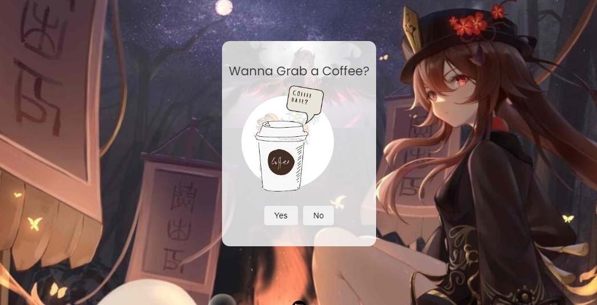

# Asking for a Coffe Date 

A simple interface to confirm acceptance of a coffee date invitations. 




## Features

- Displays a message.
- Provides a link to go back to the homepage.
- Includes a link to the project's GitHub repository.

## Technologies Used

- HTML
- CSS
- JavaScript

## How to Use

1. Clone the repository:
   ```sh
   git clone https://github.com/KushagraKumar04/Coffee-Date.git
